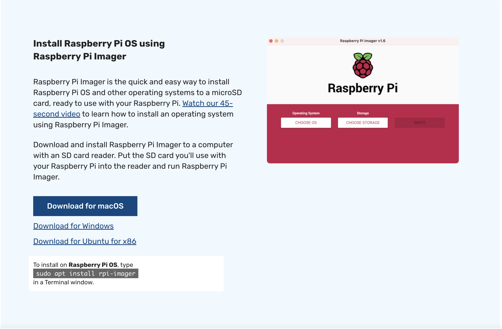
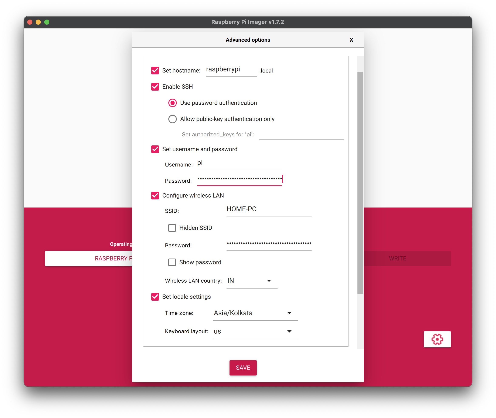
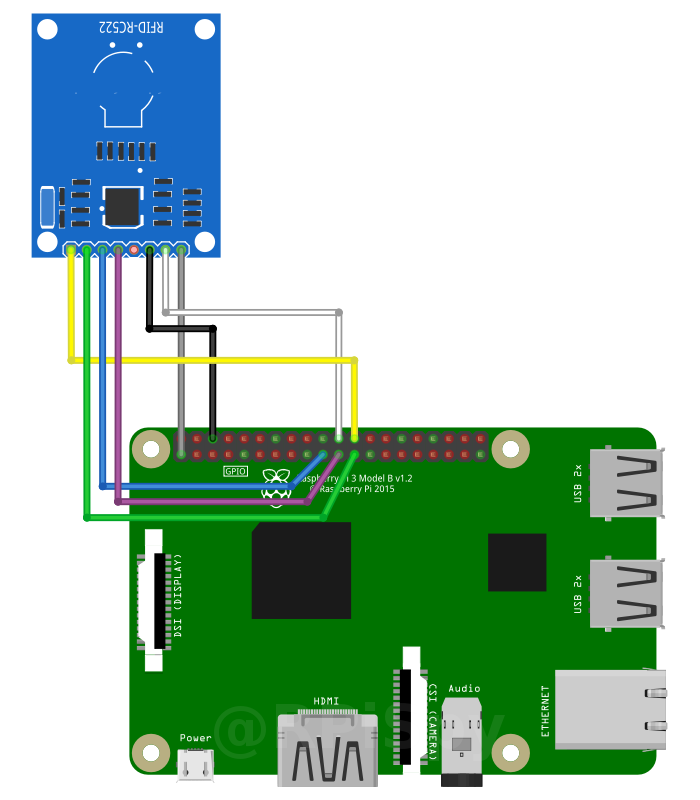

# Build your own EasyCard payment system

## With Raspberry Pi, RFID and Google Cloud

### Setup Raspberry Pi

Go to https://www.raspberrypi.com/software/ to download the Raspberry Pi Imager, or download the OS manually from here.

In either method, for Raspberry Pi 4 with 4 GB+ RAM, 64-bit version of the Raspberry Pi OS is recommended. If you have downloaded the image manually, use https://www.balena.io/etcher/ (balenaEtcher) to flash a microSD card (with recommended capacity of 8 GB+) with the OS image.

For headless setup (setup without any monitor/KB/mouse) with Raspberry Pi Imager, please fill the necessary details in the below configuration page.

### Connect Pi with MFRC522 RFID module

Please follow the below wiring diagram with the table guide to connect Pi with the rfid module.

| MFRC522 Header | Diagram Colour | Pi Header | Notes         |
| -------------- | -------------- | --------- | ------------- |
| 3.3V           | Grey           | 1         | 3.3V          |
| RST            | White          | 22        | GPIO25        |
| GND            | Black          | 6         | Ground        |
| IRQ            | –              | –         | Not connected |
| MISO           | Purple         | 21        | GPIO9         |
| MOSI           | Blue           | 19        | GPIO10        |
| SCK            | Green          | 23        | GPIO11        |
| SDA            | Yellow         | 24        | GPIO8         |

Raspberry Pi GPIO pin diagram is available here: https://pinout.xyz/

### Mifare Classic 1K card memory dumps
1. [Factory Formatted Card](memdumps/factory.txt)

2. [NDEF Formatted Card](memdumps/ndef.txt)

3. [NDEF Formatted Card with text data](memdumps/ndef_text.txt)
### Recommended apps to play with NFC cards

1. **NFC Tools:** https://play.google.com/store/apps/details?id=com.wakdev.wdnfc

2. **NFC TagInfo by NXP:** https://play.google.com/store/apps/details?id=com.nxp.taginfolite

3. **NFC TagWriter by NXP:** https://play.google.com/store/apps/details?id=com.nxp.nfc.tagwriter

### Slides for hardware section of this project

[Build your own EasyCard payment system - Hardware](https://www.canva.com/design/DAFDyahEmrc/w9kpbjLRgV7VQUv4JQQUKA/view?utm_content=DAFDyahEmrc&utm_campaign=designshare&utm_medium=link2&utm_source=sharebutton)

[Build your own EasyCard payment system - Cloud](https://xpri.dev/build-your-easycard)

